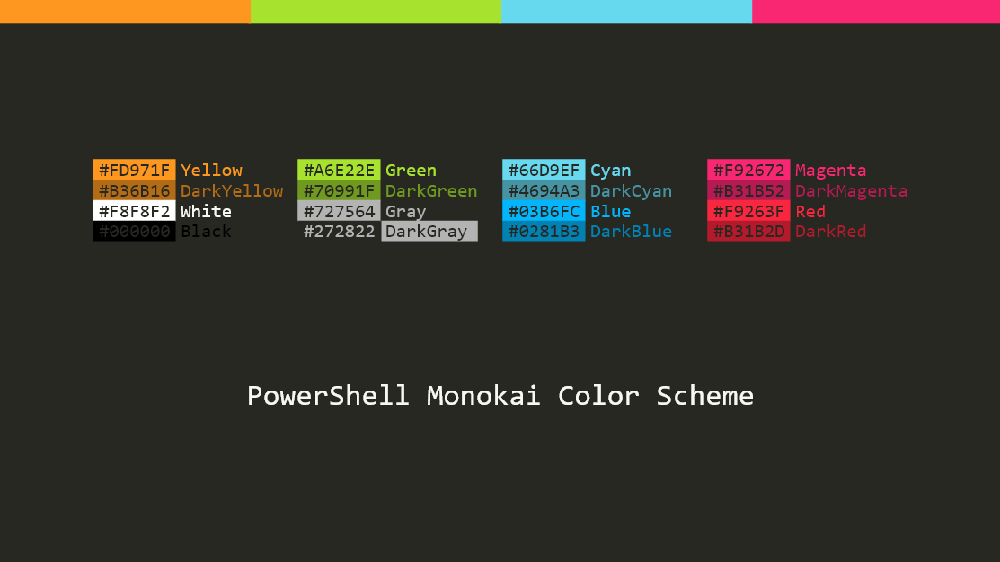
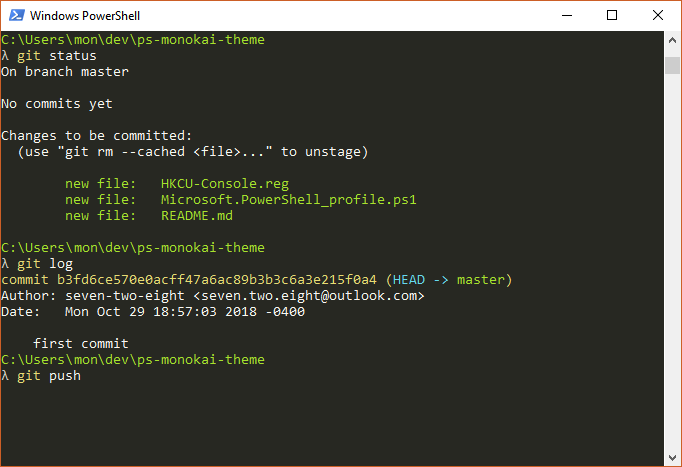

# PowerShell Monokai Theme


## Installation
* Warning: installation below changes registry irreversibly. You may want to create backup of the items mentioned in `colors.reg` before proceed.
* Clone or [download](https://github.com/seven-two-eight/ps-monokai-theme/zipball/master) the git repo
    ```
    git clone https://github.com/seven-two-eight/ps-monokai-theme.git
    ```
    

* Run `install.ps1` with administrator privilege from the repo folder to import registry and PowerShell profile.

    - Or you can do this manually by double clicking `colors.reg`, and then copy `Microsoft.PowerShell_profile.ps1` from the repo folder to `$HOME\Documents\WindowsPowerShell\Microsoft.PowerShell_profile.ps1`.

    - The profile script works for PowerShell 5 and some versions of PowerShell 6 (depending on your version of `PSReadline` module). 

* Restart all PowerShell instances to see effect.
    - Note each shortcut of `powershell.exe` has its own color pallets. You need to recreate such shortcut to see the effect.
    - If you use VS Code, you can enforce the integrated terminal background color by setting:   
        ```
        "workbench.colorCustomizations" : {"terminal.background" : "#272822"}
        ```

## Screenshots



## Credits
* `colors.reg` is inspired by `HKCU-Console.reg` from the archived repo `https://github.com/ntwb/posh-monokai`.
* `Microsoft.PowerShell_profile.ps1` is set up to reproduce Cmder-style prompt.
* Monokai color scheme is created by [Wimer Hazenberg](https://web.archive.org/web/20161107090516/http://www.monokai.nl/blog/2006/07/) (correct me if I'm wrong).